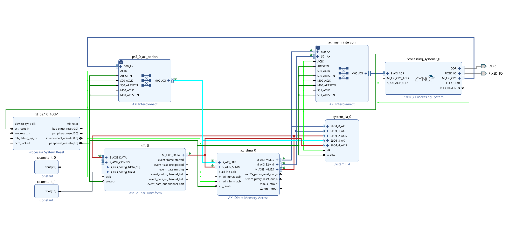
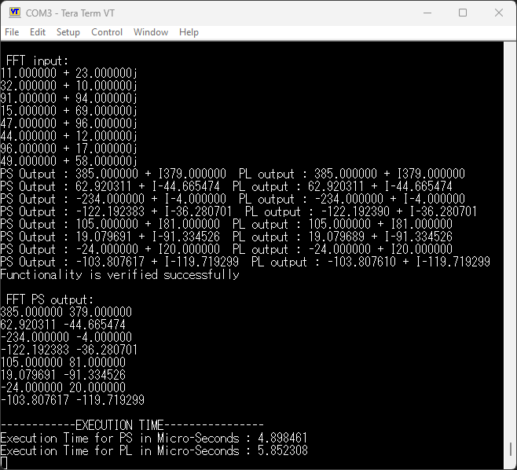

# FFT Hardware Acceleration on Xilinx Zynq using AXI DMA

Hardware-accelerated FFT implementation on **Xilinx Zynq-7000 SoC** using **AXI DMA**, with software (PS) vs hardware (PL) benchmarking and output verification.

---

## Project Overview

This project implements an **8-point Fast Fourier Transform (FFT)** using two execution methods:

### Processing System (PS)

* ARM Cortex-A9 processor on Zynq
* FFT implemented in C
* Input reordering + butterfly stages

### Programmable Logic (PL)

* Xilinx FFT IP Core
* Connected through AXI DMA
* Hardware acceleration using FPGA fabric

Both outputs are compared for correctness, and execution times are measured.

---

## Hardware Platform

* **Board:** Digilent Arty Z7-20
* **SoC:** Xilinx Zynq-7000
* **Toolchain:** Vivado 2021.2 + Vitis SDK
* **Language:** C

---

## System Architecture

Input samples are sent from PS memory to the FFT IP core using AXI DMA.

FFT results are transferred back to memory and compared against software-generated FFT output.

```text
Input Samples
     ↓
Processor (PS) Software FFT

Input Samples
     ↓
AXI DMA → FFT IP Core (PL) → AXI DMA
     ↓
Output Buffer
```

---

## Vivado Block Design



The hardware design includes:

* ZYNQ7 Processing System
* AXI DMA
* FFT IP Core
* AXI Interconnect
* Reset / Clocking Logic
* System ILA for debugging

---

## UART Output / Verification



The UART terminal confirms:

* PS FFT output matches PL FFT output
* Numerical correctness verified
* Execution time captured for both modes

---

## Performance Results

| Mode            | Execution Time (µs) |
| --------------- | ------------------- |
| PS Software FFT | 4.898               |
| PL Hardware FFT | 5.852               |

> For an 8-point FFT, DMA setup overhead dominates total latency. Hardware acceleration becomes more beneficial for larger FFT sizes.

---

## Software Features

* Custom FFT implementation in C
* Input bit-reversal reordering
* Multi-stage butterfly computation
* DMA initialization and transfers
* Cache flush handling
* Result validation
* Runtime benchmarking using XTime

---

## Repository Structure

```text
fft-zynq-axi-dma/
│── README.md
│── src/
│   └── fft_dma_benchmark.c
│── hardware/
│   ├── Lab3_FFT_DMA.xpr
│   ├── Lab3_FFT_DMA_BD.bd
│   └── Lab3_FFT_DMA_BD_wrapper.xsa
│── images/
│   ├── block_design.png
│   └── uart_output.png
```

---

## Skills Demonstrated

* Embedded Systems Programming
* FPGA Design
* AXI DMA Integration
* DSP / FFT Algorithms
* Hardware / Software Co-Design
* Performance Optimization
* Debugging & Verification

---

## Future Improvements

* 64-point / 256-point FFT
* Streaming AXI-Stream FFT
* Interrupt-driven DMA
* Real-time ADC signal input
* OFDM / SDR applications

---

## Author

**Saeed Omidvari**
